# 项目开发过程

技术栈：

- Create-React-App
- Vite
- Next.js
- CSS-in-JS (Styled-components, Styled-jsx, Emotion)
- React-Router
- Redux
- React-dnd

项目介绍：问卷系统的有首页、登录页、我的问卷列表页、新建问卷等，问卷卡、标星、回收站、分页等功能，以及编辑器的操作对象和左侧的组件库。此外，还有编辑器的基本功能，包括单选和多选属性的操作、组件库的扩展性、图层的拖拽排序和隐藏取消隐藏等功能。有页面设置和插入代码的功能。还有保存或自动保存编辑文件，发布后跳转到问卷统计页面，可以通过链接或二维码访问H5页面提交答卷，之后可以汇总统计信息和图表汇总统计。问卷统计页面同时具有复杂性和联动性。在完成操作后，可以退出登录。

也就是说问卷系统的功能可以分为以下几个模块：

1. **页面结构:**

   - 首页
   - 登录页
   - 我的问卷列表页
   - 新建问卷页

2. **问卷功能:**

   - 问卷卡
   - 标星
   - 回收站
   - 分页

3. **编辑器功能:**

   - 操作对象
   - 左侧组件库
   - 单选和多选属性操作
   - 组件库扩展性
   - 图层的拖拽排序和隐藏取消隐藏

4. **基本编辑功能:**

   - 页面设置
   - 插入代码
   - 保存或自动保存编辑文件

5. **问卷发布和访问:**

   - 发布后跳转到问卷统计页面
   - 通过链接或二维码访问H5页面提交答卷

6. **统计和汇总:**

   - 汇总统计信息
   - 图表汇总统计
   - 复杂的问卷统计页面
   - 联动性统计信息

7. **用户操作:**

   - 退出登录

     

问卷系统功能的简要总结，以表格形式呈现：

| 模块               | 功能                                                         |
| ------------------ | ------------------------------------------------------------ |
| **页面结构**       | 首页、登录页、我的问卷列表页、新建问卷页                     |
| **问卷功能**       | 问卷卡、标星、回收站、分页                                   |
| **编辑器功能**     | 操作对象、左侧组件库、单选和多选属性操作、组件库扩展性、图层的拖拽排序和隐藏取消隐藏 |
| **基本编辑功能**   | 页面设置、插入代码、保存或自动保存编辑文件                   |
| **问卷发布和访问** | 发布后跳转到问卷统计页面、通过链接或二维码访问H5页面提交答卷 |
| **统计和汇总**     | 汇总统计信息、图表汇总统计、复杂的问卷统计页面、联动性统计信息 |
| **用户操作**       | 退出登录                                                     |

项目UI设计

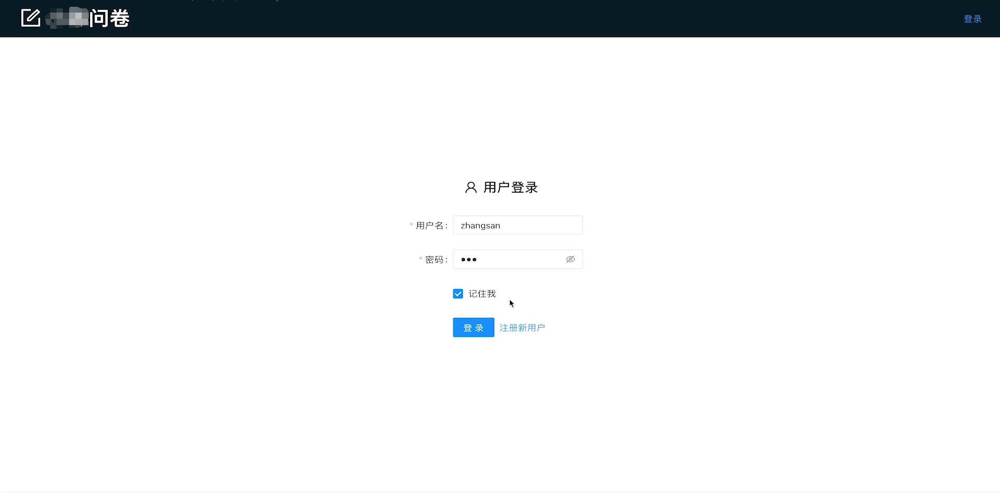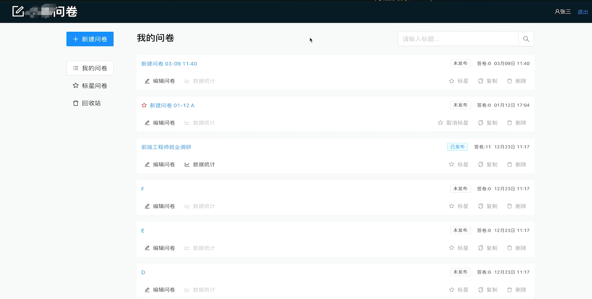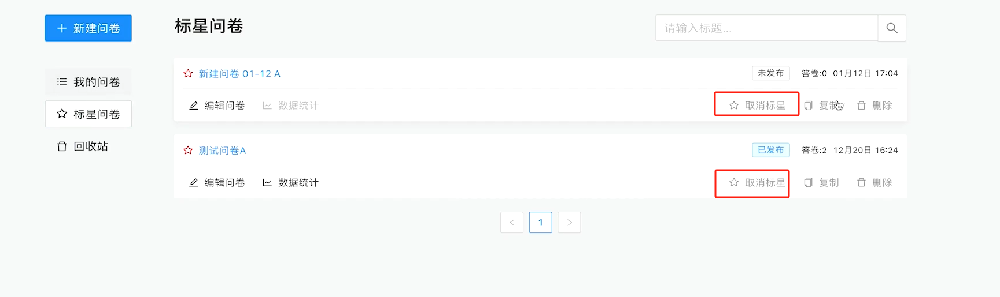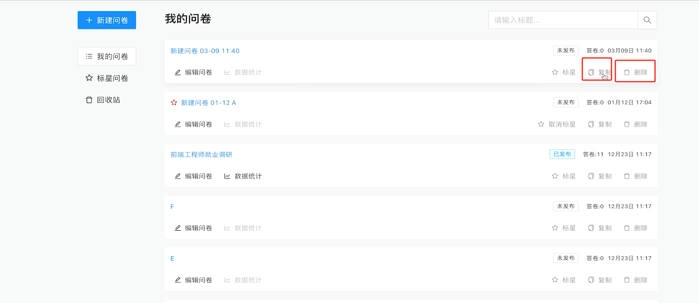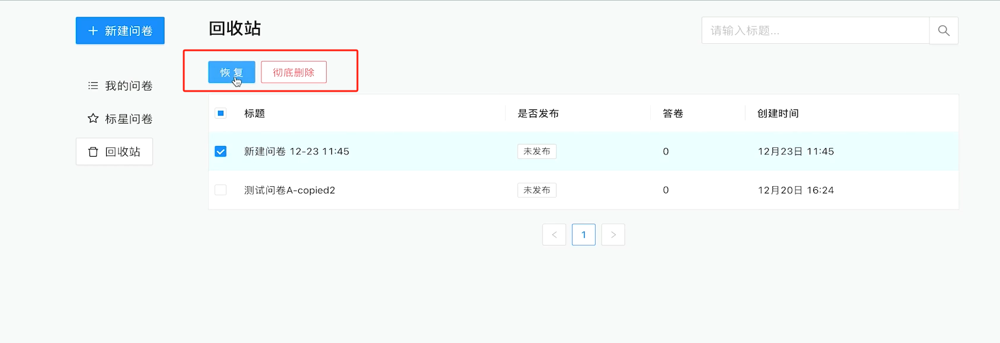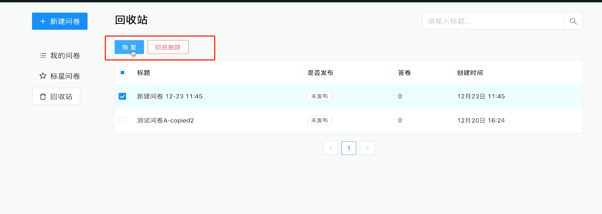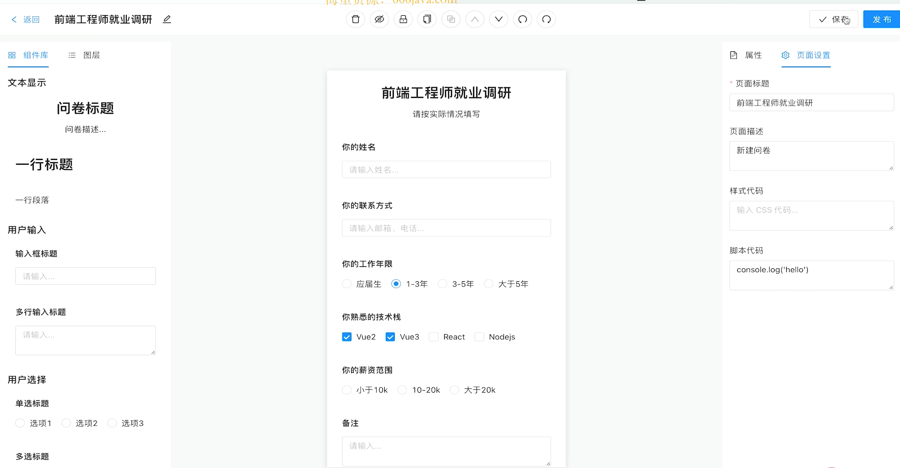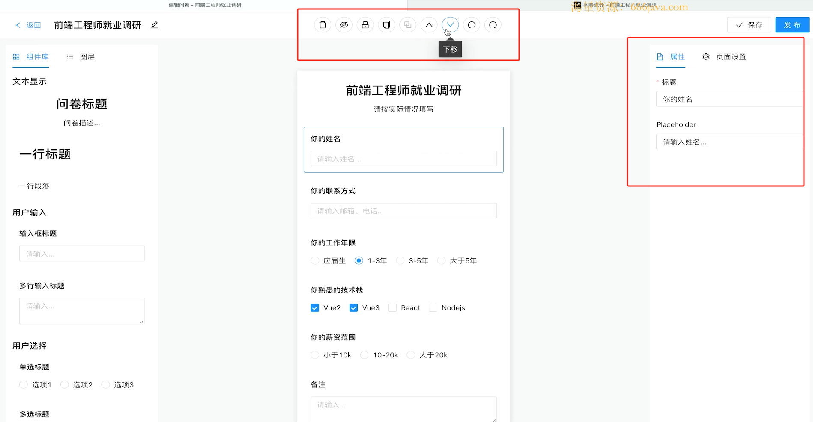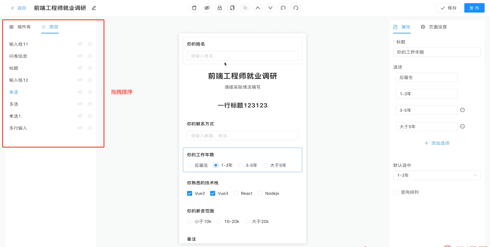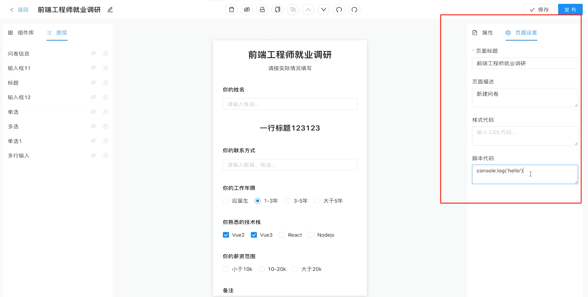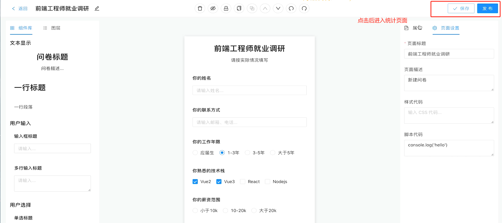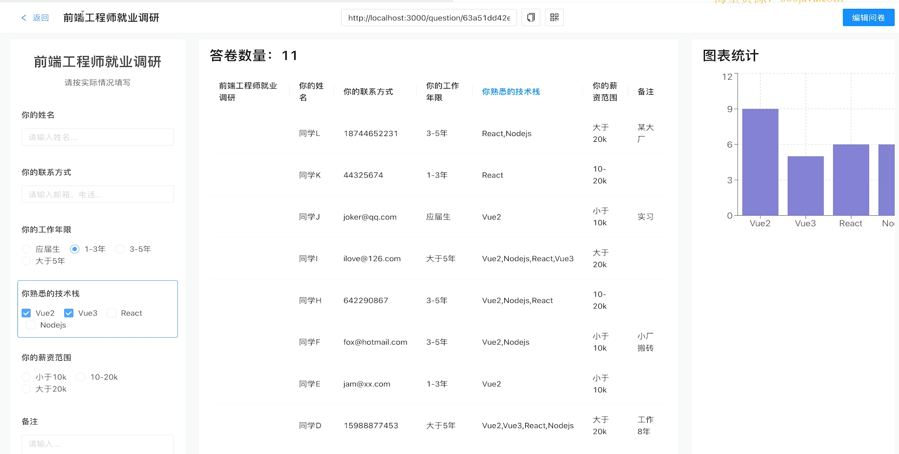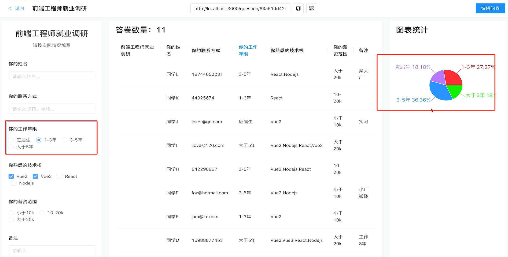
